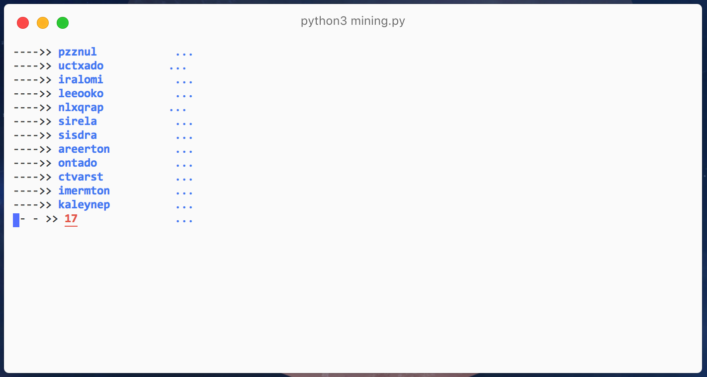

I built this script for my own needs, **maybe you need it**.

The names are produced on the basis of the first ‍‍`seeds`, which are very special grains.

What are the names made for use in what is useful?
‍‍`username`
`password`
`Unicorn and non-repetitive name`
`Product names and projects`
and ... :)


##### How to use it?

```bash
python3 mining.py
```


**Note :** If you encounter an error, find and ‍`deactivate` the following line in the source code.

```python
os.system(f"say {name}")
```





##### License
```
MIT License

Copyright (c) 2018 Abbas Naqdi

Permission is hereby granted, free of charge, to any person obtaining a copy
of this software and associated documentation files (the "Software"), to deal
in the Software without restriction, including without limitation the rights
to use, copy, modify, merge, publish, distribute, sublicense, and/or sell
copies of the Software, and to permit persons to whom the Software is
furnished to do so, subject to the following conditions:

The above copyright notice and this permission notice shall be included in all
copies or substantial portions of the Software.

THE SOFTWARE IS PROVIDED "AS IS", WITHOUT WARRANTY OF ANY KIND, EXPRESS OR
IMPLIED, INCLUDING BUT NOT LIMITED TO THE WARRANTIES OF MERCHANTABILITY,
FITNESS FOR A PARTICULAR PURPOSE AND NONINFRINGEMENT. IN NO EVENT SHALL THE
AUTHORS OR COPYRIGHT HOLDERS BE LIABLE FOR ANY CLAIM, DAMAGES OR OTHER
LIABILITY, WHETHER IN AN ACTION OF CONTRACT, TORT OR OTHERWISE, ARISING FROM,
OUT OF OR IN CONNECTION WITH THE SOFTWARE OR THE USE OR OTHER DEALINGS IN THE
SOFTWARE
```

‍